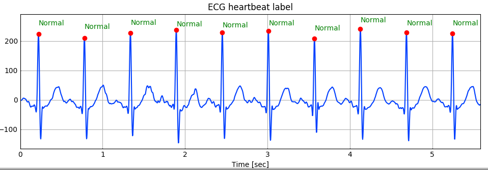
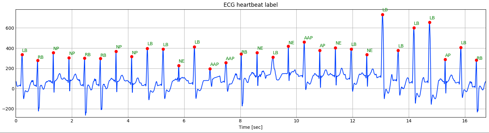

# Heartbeat Classification based Diagnosis
This is a general prototype for machine learning based heartbeat classification. Label each heartbeat in ECG. R peak detection is first performed to locate each heartbeat. 
Each heartbeat then will be classified by a CNN. Corresponding label will be printed on the top of each R peak. 
The CNN is trained using a few throusand labeled beats. Abbreviations is listed below:<br/>
**Normal:** normal, **AAP:** Aberrated Atrial Premature, **AP:** Atrial premature, **VE:** Ventricular Escape, 
**NE:** Nodal escape, **NP:** Nodal Premature, **LB:** Left Bundle Branch Block, **RB:** Right Bundle Branch Block.<br/>




### Dependencies
- Tensorflow
- Numpy
- Matplotlib
### run example
```
~$ git clone https://github.com/KChen89/Heartbeat-Classification-based-Diagnosis.git
~$ cd /your folder
~$ python3 hb_classifier.py ecg.dat
~$ python3 hb_classifier.py ECG_sample.dat
```
The model is trained using ECG sampled at 360 Hz, and length of each beat truncked are pre-defined.

#### More
- [x] Beat classification.
- [x] Print labels on top of R peak.
- [x] Combining R peak detection.
- [ ] Include more type of beat.
- [ ] Other platform (Mobile).

Please cite [1] if use. <br/>

##### Reference
[1] K. Chen, L.S. Powers, J.M.Roveda, "Noise-Invariant Components Analysis for Wearable Sensor based Electrocardiogram Monitoring System", SM Joural of Biomedical Engineering, 2018, (accepted). <br/>
